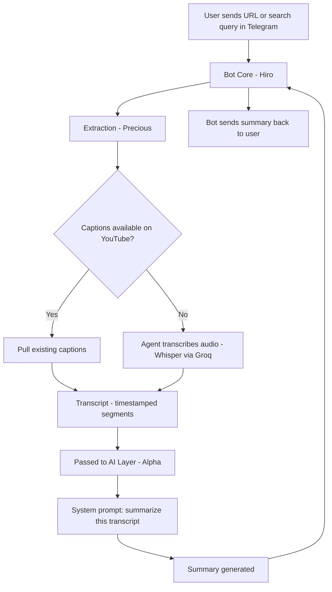

# NEXUS YT Bot

Telegram bot for YouTube video info — transcripts, summaries, clips

## How it works

```mermaid
flowchart TD
    A[User sends URL or search query in Telegram] --> B[Bot Core - Hiro]
    B --> C[Extraction - Precious]
    C --> D{Captions available on YouTube?}
    D -->|Yes| E[Pull existing captions]
    D -->|No| F[Agent transcribes audio - Whisper via Groq]
    E --> G[Transcript - timestamped segments]
    F --> G
    G --> H[Passed to AI Layer - Alpha]
    H --> I[System prompt: summarize this transcript]
    I --> J[Summary generated]
    J --> B
    B --> K[Bot sends summary back to user]
```

## Setup

*(Setup instructions to be added)*
